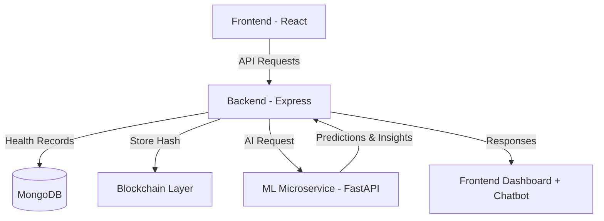

# 🏥 JEEVA – Digital Health Record Management System

<p align="center">
  
  
  
  
</p>

> 🚀 **A Blockchain & AI Powered Platform for Portable, Secure, and Smart Health Records**  
> Developed by **Team Forbidden 403**

---

## 🌟 Overview

**JEEVA** (Joint Enterprise for Excellence in Vitality Assurance) is an ongoing project that combines **Blockchain**, **Artificial Intelligence**, and **Machine Learning** to enable a next-generation **digital health ecosystem**.

It empowers individuals with:
- 🧬 **Tamper-proof medical records** stored on a blockchain.  
- 🤖 **AI-driven preventive health insights.**  
- 🗣️ **Multilingual chatbot** for simplified health interaction.  
- 📊 **Smart dashboards** for healthcare analytics and trends.

---

## 👥 Team Forbidden 403

| Member | Role |
|---------|------|
| 🧠 [**Anikesh Sharma**](https://github.com/anikesh-17) | ML + Backend Lead |
| 🔗 [**Anuj Raghuwanshi**](https://github.com/anujraghuwanshi9900) | Blockchain + Backend Developer |
| 🤖 [**Anshika Chaurasia**](https://github.com/anshikachaurasia20) | AI + Backend Developer |
| 💻 [**Amarjeet Kumar**](https://github.com/amarjeet780) | Frontend Developer |
| 👨🏻‍💻 [**Ankit Singh**](https://github.com/Ankit8081) | Frontend Developer |
| 🧩 [**Anand Kumar Singh**](https://github.com/AnandSingh06) | Backend Developer |
| 🌐 [**Jigyasha Kumari**](https://github.com/Jigyasha19) | Frontend Developer |

<p align="center">
  <a href="https://github.com/anikesh-17"></a>
  <a href="https://github.com/anujraghuwanshi9900"></a>
  <a href="https://github.com/anshikachaurasia20"></a>
  <a href="https://github.com/amarjeet780"></a>
  <a href="https://github.com/Ankit8081"></a>
  <a href="https://github.com/AnandSingh06"></a>
  <a href="https://github.com/Jigyasha19"></a>
</p>

<p align="center">
  <b>Team Forbidden 403</b><br>
  🧠 Anikesh Sharma • 🔗 Anuj Raghuwanshi • 🤖 Anshika Chaurasia • 💻 Amarjeet Kumar • 👨🏻‍💻 Ankit Singh • 🧩 Anand Kumar Singh • 🌐 Jigyasha Kumari
</p>

---

## 🏗️ Tech Stack

<p align="center">
  
  
  
  
  
</p>

| Layer | Technologies |
|-------|---------------|
| **Frontend** | React.js, Tailwind CSS, Chart.js |
| **Backend** | Node.js, Express.js, MongoDB, JWT |
| **AI / ML** | Python, FastAPI, scikit-learn, Pandas |
| **Blockchain** | Solidity / Hyperledger, Web3.js |
| **DevOps** | Docker, GitHub Actions, Vercel, Render |

---

## 🎯 Key Features (In Progress)
- ✅ **Secure Health Vaults** — Tamper-proof blockchain-based data storage.  
- ⚙️ **AI Suggestions** — ML-driven preventive healthcare recommendations.  
- 🗣️ **Multilingual Chatbot** — Easy access to health info in native languages.  
- 📊 **Analytics Dashboard** — Data visualization and health trends.  
- 🔐 **Privacy Control** — User-consented access to medical data.

---

## 🧩 System Architecture



---

## ⚙️ Setup Instructions

### 1️⃣ Clone Repository
```bash
git clone https://github.com/anikesh-17/jeeva.git
cd jeeva
```

### 2️⃣ Backend Setup
```bash
cd backend
npm install
npm run dev
```

### 3️⃣ ML Microservice Setup
```bash
cd ml-service
pip install -r requirements.txt
python app.py
```

### 4️⃣ Frontend Setup
```bash
cd frontend
npm install
npm start
```

> 🧩 Ensure your `.env` files are configured correctly using the provided `.env.example` file.

---

## 📊 API Endpoints (Sample)

| Method | Endpoint | Description |
|--------|-----------|-------------|
| `POST` | `/auth/register` | Register a new user |
| `POST` | `/auth/login` | Authenticate a user |
| `GET` | `/patients` | Retrieve patient records |
| `POST` | `/patients` | Add new health record |
| `GET` | `/suggestions/:id` | Fetch AI-generated health advice |

---

## 🧠 AI Module – Immunity Index (Ongoing)
Predicts user health risk using medical, lifestyle, and nutrition data.

**Sample Output:**
```json
{
  "immunity_score": 0.85,
  "risk_level": "Low",
  "recommendations": [
    "Maintain regular physical activity",
    "Monitor blood sugar levels periodically"
  ]
}
```

---

## 🧭 Development Roadmap

| Phase | Description | Status |
|--------|-------------|---------|
| ⚙️ **Phase 1** | **Project Setup & Dependency Installation** — initialized all repositories (frontend, backend, ML, blockchain) and configured environments, packages, and version control. | ✅ Completed |
| 💻 **Phase 2** | **Frontend Development** — building the React-based user interface, authentication pages, dashboard layout, and chatbot integration design. | ⚙️ In Progress |
| 🏗️ **Phase 3** | **Backend Architecture** — setting up Node.js + Express server, MongoDB schema, and API endpoints for user and health record management. | ⏳ Planned |
| 🔗 **Phase 4** | **Blockchain Layer** — developing smart contracts and integrating blockchain-based record verification using Web3.js / Hyperledger. | ⏳ Planned |
| 🧠 **Phase 5** | **ML Microservice** — creating the Immunity Index model and preventive health suggestion APIs using FastAPI and Python. | ⏳ Planned |
| 📊 **Phase 6** | **Analytics Dashboard & Policy Insights** — implementing data visualization for users, doctors, and admins using Chart.js and MongoDB aggregation. | ⏳ Planned |
| 🚀 **Phase 7** | **Final Integration & Deployment** — connecting all modules (frontend, backend, AI, and blockchain), setting up CI/CD, and deploying to production. | ⏳ Planned |

---


## 🧰 Tools & Workflow
- 🧱 **Version Control:** Git + GitHub  
- 📋 **Project Management:** Trello + Notion  
- 🧪 **Testing:** Postman / Hoppscotch
- 🎨 **Design:** Canva
- ☁️ **Deployment:** Vercel (Frontend), Render (Backend & ML)

---

## 📸 UI Concepts (In Progress)
<p align="center">
  
  
</p>

---

<p align="center">
  Made with ❤️ by <b>Team Forbidden 403</b><br>
  <i>#Blockchain #AI #MachineLearning #HealthTech #WebDevelopment</i>
</p>
