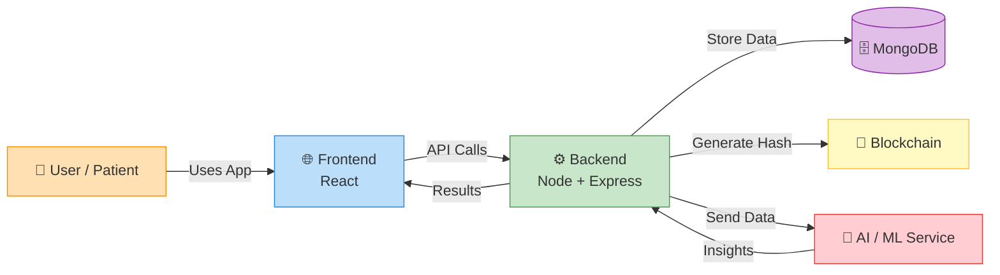
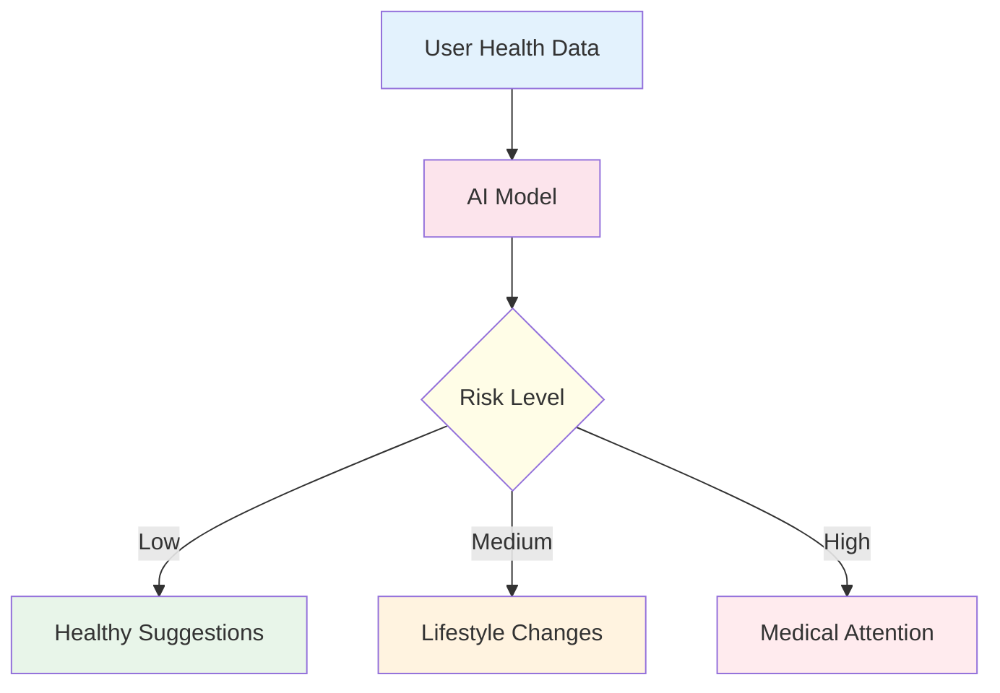
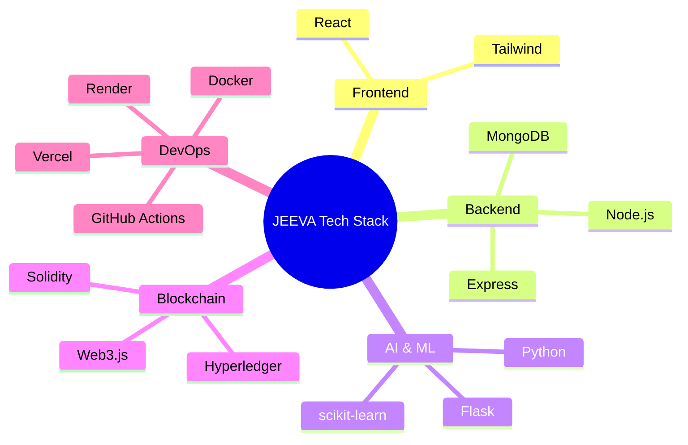

# 🏥 JEEVA – Digital Health Record Management System

  
  
  

---

## 🌈 What is JEEVA?

**JEEVA (Joint Enterprise for Excellence in Vitality Assurance)** is a next-generation **Digital Health Record Management System**.

It allows users to:
- Securely store medical records 🗂️
- Control who can access their data 🔐
- Get AI-powered health insights 🤖
- Ensure data authenticity using blockchain 🔗

> 🎯 **Goal:** Give individuals full ownership of their health data while making healthcare smarter and safer.

---

## ❗ Problem JEEVA Solves

🔴 Scattered medical records  
🔴 Risk of data tampering  
🔴 No patient control over data  
🔴 No intelligent health insights  

✅ **JEEVA brings everything into one secure, intelligent platform.**

---

## 🎨 System Architecture (Visual Flow)

```mermaid
graph LR
    A[🧑 User / Patient] -->|Uses App| B[🌐 Frontend<br/>React]
    B -->|API Calls| C[⚙️ Backend<br/>Node + Express]
    C -->|Store Data| D[(🗄️ MongoDB)]
    C -->|Generate Hash| E[🔗 Blockchain]
    C -->|Send Data| F[🧠 AI / ML Service]
    F -->|Insights| C
    C -->|Results| B

    style A fill:#FFE0B2,stroke:#FB8C00
    style B fill:#BBDEFB,stroke:#1E88E5
    style C fill:#C8E6C9,stroke:#43A047
    style D fill:#E1BEE7,stroke:#8E24AA
    style E fill:#FFF9C4,stroke:#FBC02D
    style F fill:#FFCDD2,stroke:#E53935
```

---

## 🌟 Core Features Explained

### 🔐 Secure Health Records
- Records stored safely in database
- Blockchain stores cryptographic hash
- Any tampering is instantly detectable

### 🤖 AI Health Insights
- Predicts health risks
- Generates Immunity Index
- Suggests preventive care

### 🗣️ Smart Chatbot
- Ask health questions in simple language
- Multilingual support
- User-friendly interface

### 📊 Analytics Dashboard
- Visual health trends
- Easy-to-understand charts
- Useful for patients & doctors

### 🔑 Privacy Control
- User-controlled permissions
- Doctor access only with consent

---

## 🧠 AI Module – Immunity Index

```mermaid
flowchart TD
    A[User Health Data] --> B[AI Model]
    B --> C{Risk Level}
    C -->|Low| D[Healthy Suggestions]
    C -->|Medium| E[Lifestyle Changes]
    C -->|High| F[Medical Attention]

    style A fill:#E3F2FD
    style B fill:#FCE4EC
    style C fill:#FFFDE7
    style D fill:#E8F5E9
    style E fill:#FFF3E0
    style F fill:#FFEBEE
```

---

## 🧰 Technology Stack

```mermaid
mindmap
  root((JEEVA Tech Stack))
    Frontend
      React
      Tailwind
    Backend
      Node.js
      Express
      MongoDB
    AI & ML
      Python
      Flask
      scikit-learn
    Blockchain
      Solidity
      Hyperledger
      Web3.js
    DevOps
      Docker
      GitHub Actions
      Vercel
      Render
```

---

## 👥 Team Arceus 🍀

| Name | Role |
|------|------|
| Anikesh Sharma | ML & Backend |
| Anuj Raghuwanshi | Blockchain & Backend |
| Amarjeet Kumar | Frontend |

  
  
  

---

## 🧭 Development Roadmap

| Phase | Description | Status |
|--------|-------------|---------|
| ⚙️ **Phase 1** | **Project Setup & Dependency Installation** — initialized all repositories (frontend, backend, ML, blockchain) and configured environments, packages, and version control. | ✅ Completed |
| 💻 **Phase 2** | **Frontend Development** — building the React-based user interface, authentication pages, dashboard layout, and chatbot integration design. | ⚙️ In Progress |
| 🏗️ **Phase 3** | **Backend Architecture** — setting up Node.js + Express server, MongoDB schema, and API endpoints for user and health record management. | ⚙️ In Progress |
| 🔗 **Phase 4** | **Blockchain Layer** — developing smart contracts and integrating blockchain-based record verification using Web3.js / Hyperledger. | ⏳ Planned |
| 🧠 **Phase 5** | **ML Microservice** — creating the Immunity Index model and preventive health suggestion APIs using FastAPI and Python. | ⚙️ In Progress |
| 📊 **Phase 6** | **Analytics Dashboard & Policy Insights** — implementing data visualization for users, doctors, and admins using Chart.js and MongoDB aggregation. | ⏳ Planned |
| 🚀 **Phase 7** | **Final Integration & Deployment** — connecting all modules (frontend, backend, AI, and blockchain), setting up CI/CD, and deploying to production. | ⏳ Planned |
 

---

## 🔮 Future Scope

- Hospital integration 🏥
- Emergency access mode 🚑
- Government health schemes 🇮🇳

---

  ❤️ Built with passion by <b>Team Arceus 🍀</b> 
  <i>#HealthTech #Blockchain #AI #WebDevelopment</i>

