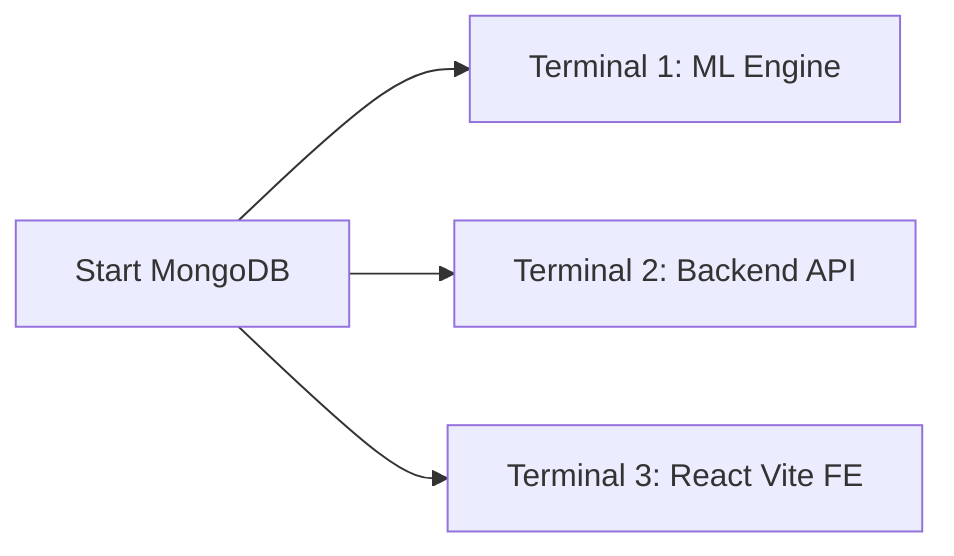

# 🏥 JEEVA: Joint Enterprise for Excellence in Vitality Assurance
### Decoupled AI Disease Screening & Cryptographically Secured Medical Ledger

JEEVA is an enterprise-grade digital health ecosystem that empowers patients with complete control and sovereignty over their diagnostic reports. It seamlessly integrates **Machine Learning Screening Engines** with a **Sha-256 Private Proof-of-Work Blockchain** and a **Real-time Vitals Dashboard**. 

---

## ⚡ Naive User Quickstart (1-Click Run)

If you are running on Windows, you do **not** need to manually configure environments, create databases, or install packages in separate terminal windows. We have created a unified automation script that does it all for you.

### 1️⃣ The 1-Click Launch (Recommended)
1. Ensure you have **Node.js**, **Python (v3.9+)**, and **MongoDB** installed on your machine.
2. Locate the file [start.bat](file:///c:/Users/raghu/Downloads/JEEVA-main/JEEVA-main/start.bat) in the root folder.
3. **Double-click `start.bat`**.
   * *The script will verify your Node, Python, and MongoDB runtimes.*
   * *It automatically installs node packages in `/backend` and `/frontend/jeeva-frontend` if they are missing.*
   * *It launches the Python Flask service, the Express Server, and the Vite Client in separate labeled command prompt windows.*
4. Open your web browser and navigate to **`http://localhost:5173`**!

---

### 2️⃣ Manual Execution (Linux / macOS / Fallback)

If you are on macOS, Linux, or prefer to launch manually, open three separate terminal tabs and execute the commands below:


```mermaid
graph LR
    A[Start MongoDB] --> B[Terminal 1: ML Engine]
    A --> C[Terminal 2: Backend API]
    A --> D[Terminal 3: React Vite FE]
```

#### **Terminal 1: Machine Learning Microservice**
```bash
cd ml-service/jeeva-ml
# Install dependencies
pip install -r requirements.txt
# Start Flask Server (starts on Port 5000)
python app.py
```
* **Verify Endpoint:** Open `http://localhost:5000/` in your browser. You will receive `{"status":"ok","models_loaded":[...]}`.

#### **Terminal 2: Express API Backend**
```bash
cd backend
# Install packages
npm install
# Start Express Server (starts on Port 4000)
node server.js
```
* **Verify Endpoint:** Terminal logs will print `Connected to MongoDB` and `Backend listening on port 4000`.

#### **Terminal 3: React Vite Client**
```bash
cd frontend/jeeva-frontend
# Install packages
npm install
# Launch dev server on Port 5173 (strict)
npx vite --port 5173 --strictPort
```
* **Verify Endpoint:** Open browser and load `http://localhost:5173`.

---

## ⚙️ Technology Stack & Languages Used

JEEVA is designed around a decoupled, microservices architecture where each component leverages languages and tools optimized for its specific runtime duties.

| Subsystem / Layer | Primary Language | Framework / Engine | Core Libraries & Packages | Crucial Roles |
| :--- | :--- | :--- | :--- | :--- |
| **Blockchain Ledger** | **JavaScript (ES6+)** | Custom Native Node.js Module | `crypto` (native) | SHA-256 block mining (Proof-of-Work), genesis generation, ledger validation, and verification queries. |
| **Database** | **NoSQL (JSON Docs)** | MongoDB Community Server | Mongoose ODM | Stores patient profiles, authentication refs, medical vitals history, and block logs for offline validation. |
| **Backend Core** | **JavaScript (Node.js)** | Express.js | Firebase Admin SDK, `cors`, `dotenv` | Token authentication validation, backend routes, proxying ML inputs, database query orchestration. |
| **Frontend UI** | **JavaScript (React.js)** | Vite Build Tool | TailwindCSS, Recharts, React-Icons, Firebase Client SDK | Patient vitals dashboard, profile controls, dynamic charting, disease input screens, responsive layout toggle. |
| **Machine Learning** | **Python (v3.9+)** | Flask Microframework | Scikit-Learn, NumPy, Pandas, Joblib | Classifies disease profiles (Diabetes, Heart, Breast Cancer, Parkinson's) and calculates risk probabilities. |

---

### Deep Dive into the Blockchain Mechanics
The ledger is built inside the backend utilizing Node's built-in `crypto` library.
* **Algorithm:** **SHA-256** (Secure Hash Algorithm 256-bit).
* **Hash Calculation:** The hash is a cryptographic signature generated by hashing:
  $$\text{Hash} = \text{SHA256}(\text{JSON.stringify}(recordData) + previousHash + timestamp + nonce)$$
* **Proof of Work (PoW):** Employs a difficulty factor of `2`. When mining a block, the engine loops, incrementing `nonce` until the resulting hash starts with `00`.
* **Storage:** Mined blocks are saved to a dedicated `blocks` collection in MongoDB, ensuring that history persists across restarts.

---

## 🏗️ How We Created It (Engineering History)

The engineering journey of JEEVA progressed through five iterative architectural stages:

### Phase 1: Frontend Client Scaffolding
We initialized a React project powered by Vite for fast hot-module replacement. Standard styling was replaced with **TailwindCSS** to build a charcoal-and-emerald themed user interface. We configured `react-router-dom` to manage Single Page Application routing across the Dashboard, Profile, AI Screenings, and Blockchain Audit Ledger.

### Phase 2: Python ML Engine Serialization
We built a decoupled Python Flask microservice to load pre-trained binary classifiers. Using `joblib`, we serialized trained scikit-learn models (such as random forests and SVMs). Flask endpoints were exposed to ingest patient vital vectors, compute diagnostic predictions, and output confidence values using `predict_proba()`.

### Phase 3: Blockchain Utility Architecture
To enforce immutability, we designed a custom blockchain registry inside Node.js. We defined a block structure consisting of an index, timestamp, medical record details (glucose, max heart rate, etc.), miner nonce, previous block hash, and current block hash. The Proof-of-Work hashing loop was tuned to process blocks instantly on local CPUs.

### Phase 4: Express Gateway & Database Connection
We set up an Express API backend and connected it to MongoDB via Mongoose. We created dual schemas: `User` (vitals, schedules, predictions) and `Block` (blockchain ledger data). To secure the API, we configured **Firebase Admin SDK** as a middleware wrapper, which inspects client request headers, decodes JWT tokens, and maps endpoints to authenticated Firebase users.

---

### 🔧 Key Integration Bugs & Resolutions
During assembly, we encountered and resolved several critical system bugs:

#### 1. Firebase Client Authentication Delay (Race Condition)
* **Problem:** React components initialized and attempted API database requests immediately upon mount. Since Firebase takes a short period to verify the user session on load, `auth.currentUser` initially returned `null`, throwing authentication errors and locking the screen.
* **Resolution:** We created an auth guard that checks for loading states (`!authLoading && user`) before issuing database fetches, keeping the UI loading spinner active until Firebase reports a verified session.

#### 2. Mongoose Array Subdocument ID Casting Crash (`BSONError`)
* **Problem:** Adding or removing appointments sent custom alphanumeric string IDs (e.g., `"vxz78p2aj"`) generated by the frontend. Mongoose automatically mapped the `id` key to `_id` and attempted to cast it to a standard 12-byte MongoDB ObjectId. This caused a casting error, crashing the backend.
* **Resolution:** In [User.js](file:///c:/Users/raghu/Downloads/JEEVA-main/JEEVA-main/backend/models/User.js), we updated the `AppointmentSchema` structure to explicitly set `_id: false` and registered `id: String`. This forces Mongoose to leave the frontend ID as a plain string, resolving scheduling operations.

#### 3. MSYS2 Python Package Compilation Blockers
* **Problem:** Installing standard scientific packages (SciPy, NumPy) via pip on Windows MSYS2 UCRT64 systems failed due to build compilation errors (requiring CMake, Ninja, and throwing SSL errors).
* **Resolution:** We bypassed PyPI source compilation by using MSYS2's native package manager (`pacman -S mingw-w64-ucrt-x86_64-python-numpy ...`) to download precompiled binaries, allowing Python's native scikit-learn dependencies to run instantly.

#### 4. Vite Dynamic Port Shifting and CORS Origin Errors
* **Problem:** If port `5173` was busy, Vite would run the frontend on `5174`. The backend rejected requests from `5174` since it wasn't listed in CORS origins.
* **Resolution:** We updated [server.js](file:///c:/Users/raghu/Downloads/JEEVA-main/JEEVA-main/backend/server.js) to whitelist both ports and configured Vite with strict port options (`--port 5173 --strictPort`) to prevent unexpected port shifting.

---

## 🎤 Line-by-Line Presentation Playbook (Interview/Client Demo)

Use this complete presentation script to demo JEEVA. **Follow the actions and read the spoken text.**

```
        [THE 5-STEP LIVE DEMONSTRATION FLOW]
        
   🌐 Secure Login  ──>  📊 Live Vitals  ──>  🧠 AI Disease Screen  ──>  🔗 Verify Blockchain
      (Firebase)          (MongoDB)            (Flask Predict)          (SHA-256 Audit)
```

---

### Step 1: Secure Authentication
* **Action:** Open `http://localhost:5173` in your browser. Show the login page. Sign in using email or Google Auth.
* **Speak:**
  > *"I will begin by signing into the JEEVA platform. Our security model uses **Firebase Client-Side Authentication**. When a user logs in, Firebase returns a secure JSON Web Token (JWT) to the client. This token is securely appended to the authorization header of every API request we send. The Node.js Express server validates this token using the Firebase Admin SDK. This guarantees that patient health records are protected and inaccessible to unauthorized actors."*

---

### Step 2: Vitals Dashboard & MongoDB Integration
* **Action:** Click on the profile avatar in the upper right. Click "My Profile". Change "Weight" to `72` and "Systolic BP" to `120`. Click "Save Profile". Return to the Dashboard and show the cards and graphs.
* **Speak:**
  > *"We are now on the patient dashboard. All metrics shown here—including Heart Rate, Blood Pressure, and BMI—are retrieved dynamically from our **MongoDB database**. If I navigate to 'My Profile' and update the vitals, the frontend dispatches an HTTP PUT request to the backend. The backend updates the patient's record in MongoDB. Going back to the dashboard, you can see that the numeric tiles, status alerts, and historical trends have updated immediately, reflecting the database write."*

---

### Step 3: Run AI Disease Prediction
* **Action:** Click "Jeeva AI" on the sidebar. Select "Diabetes Screening". Enter: Glucose `130`, BP `82`, Skin `20`, Insulin `80`, BMI `29`, Pedigree `0.4`, Age `35`. Click "Run Prediction".
* **Speak:**
  > *"Let's run an AI health risk screening. Under the 'Jeeva AI' menu, we can choose from multiple predictive models. When we input the clinical vitals and click 'Run Prediction', the Node.js backend intercepts the request and sends the inputs as a feature vector to our **Python Flask Machine Learning Engine**. 
  > The Flask service runs the data through a pre-trained Scikit-Learn Classifier, calculates the risk, and returns a confidence percentage. The result is saved directly to the database and mapped onto the risk gauge on our screen."*

---

### Step 4: Cryptographic Blockchain Ledger Verification
* **Action:** Click "Audit Ledger" on the sidebar. Locate your diagnostic screening record in the table. Click the "Verify" button. Show the green verification popup.
* **Speak:**
  > *"Medical data must be protected against tampering. When a prediction is generated, JEEVA hashes the inputs, outcome, and timestamp using the **SHA-256 algorithm**. This block is mined with a Proof-of-Work nonce and appended to our ledger.
  > If we go to the 'Audit Ledger' page and click 'Verify Block', the backend recalculates the cryptographic chain of hashes starting from the genesis block. If the calculated hash matches the stored hash, the ledger is verified as untampered. If any database record is altered, the hash signature breaks, indicating unauthorized data manipulation."*

---

### Step 5: Accessibility Settings (Dark/Light Mode)
* **Action:** Click "Settings" on the sidebar. Toggle the "Dark Mode" switch. Watch the interface transition to light mode and back to dark mode.
* **Speak:**
  > *"Finally, we prioritized user accessibility. In 'Settings', patients can toggle between dark and light modes. The styling uses custom TailwindCSS themes to shift from a high-contrast dark palette to a clean daylight UI, ensuring accessibility on various monitors and mobile displays."*

---

## 🙋 Expected Interviewer Q&A

#### 💬 Q1: Why use a custom private blockchain inside Node.js instead of a public network like Ethereum?
> *"Public blockchains store transaction data publicly and charge gas fees. For clinical applications, storing raw medical records on a public ledger violates privacy regulations like HIPAA, and gas fees make real-time predictions expensive. By using a private Proof-of-Work blockchain, we achieve zero transaction fees, high throughput, and data privacy, while maintaining cryptographic immutability."*

#### 💬 Q2: How does the decoupled Flask microservice benefit the application's lifecycle?
> *"Decoupling the ML service from the API gateway allows us to update and deploy prediction models independently. We can retrain models in Jupyter Notebooks, export them as pickle files, and deploy them to the Flask service without modifying the backend Node.js APIs or causing application downtime."*

#### 💬 Q3: How do you verify the integrity of the blockchain database records?
> *"The backend uses the `verifyChain()` function, which retrieves all blocks ordered by index. It reconstructs each block, recalculates its SHA-256 hash using the block's `nonce`, and asserts that it matches the stored `hash`. It then checks if the block's `previousHash` matches the hash of the preceding block. If any database document is edited, this cryptographic chain breaks."*

---

**🏥 The JEEVA Development Team**
*“Empowering patients with decentralized AI diagnostics and cryptographic trust.”*
