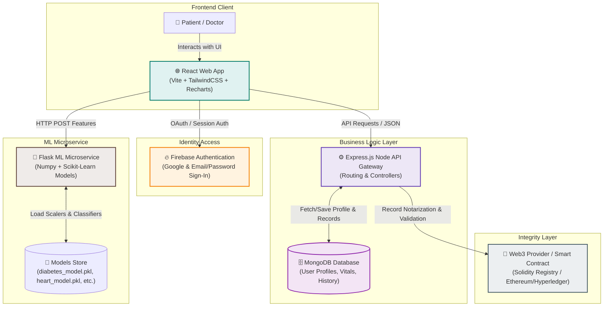
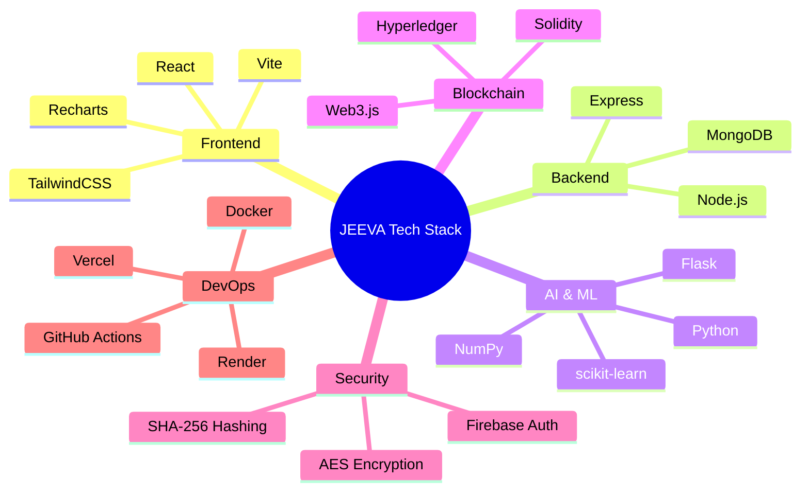
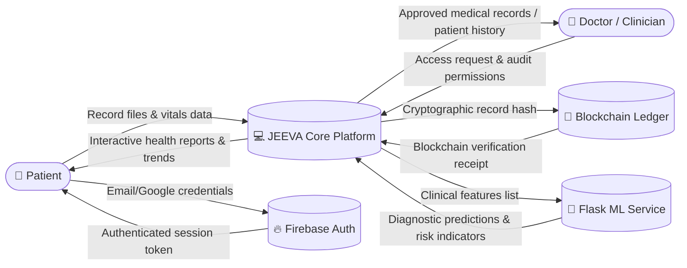
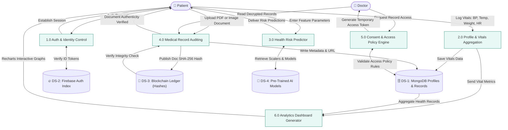
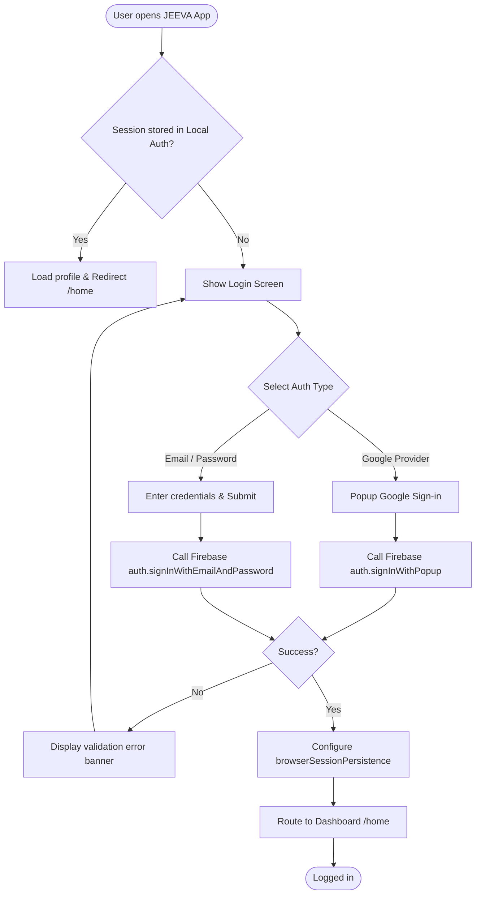
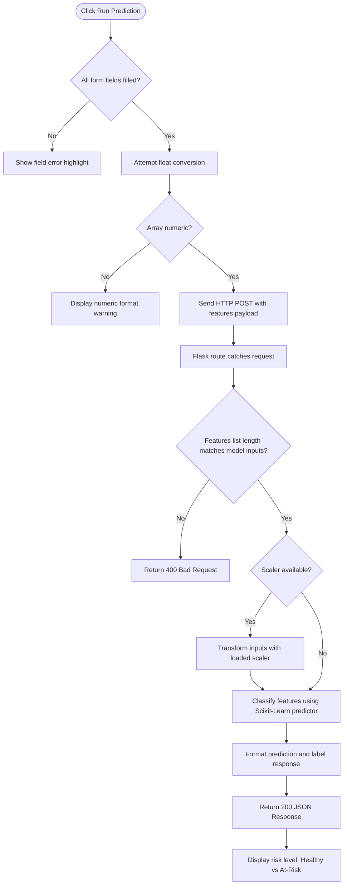
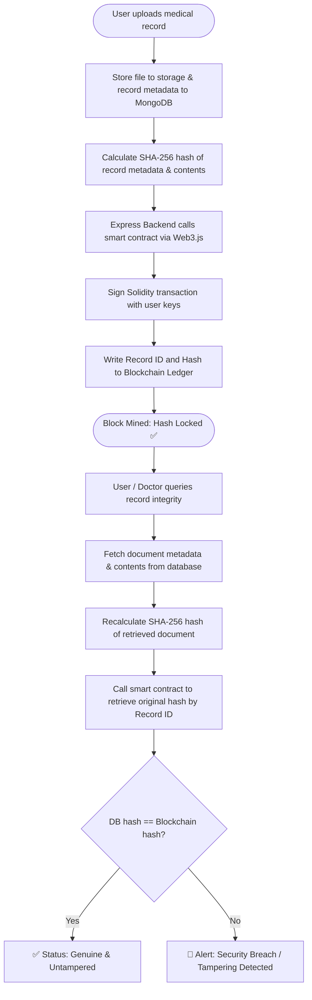
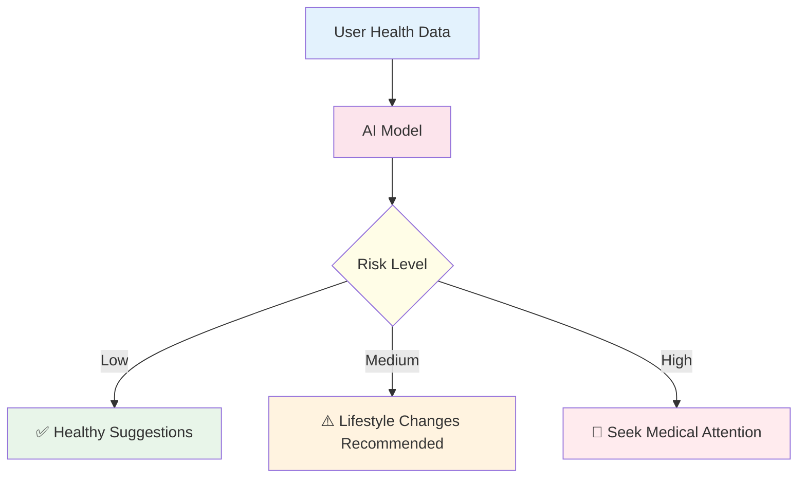

# 🏥 JEEVA – Digital Health Record Management System

<p align="center">
  
  
  
  
  
</p>

<p align="center">
  <b>Give individuals full ownership of their health data — while making healthcare smarter and safer.</b>
</p>

---

## 🌟 What is JEEVA?

**JEEVA (Joint Enterprise for Excellence in Vitality Assurance)** is a next-generation **Digital Health Record (DHR) Management System** that fuses **Machine Learning** diagnostic analytics with **Blockchain** data integrity to create a secure, private, and intelligent ecosystem for patients, doctors, and healthcare institutions.

### ❗ Problems JEEVA Solves

| Problem | Solution |
|---------|----------|
| 🔴 Scattered medical records | Unified profile with tabbed views (Overview, History, Medications, Reports, Bills) |
| 🔴 Risk of data tampering | Blockchain-stored SHA-256 hashes make malicious edits instantly detectable |
| 🔴 No patient control over data | Consent-driven access engine — patients decide who sees what |
| 🔴 No intelligent health insights | Pre-emptive AI screening for Diabetes, Heart Disease, Breast Cancer & Parkinson's |

---

## 🎨 System Architecture

JEEVA adopts a **Decoupled Microservice Architecture** to maintain clean separation between the UI, cryptographic validation, and ML computation layers.


```mermaid
graph TD
    subgraph Client Layer [Frontend Client]
        A[🧑 Patient / Doctor] -->|Interacts with UI| B["🌐 React Web App\n(Vite + TailwindCSS + Recharts)"]
    end

    subgraph Authentication & Gateway [Identity Access]
        B -->|OAuth / Session Auth| C["🔥 Firebase Authentication\n(Google & Email/Password Sign-In)"]
    end

    subgraph Core Services [Business Logic Layer]
        B -->|API Requests / JSON| D["⚙️ Express.js Node API Gateway\n(Routing & Controllers)"]
        D <-->|Fetch/Save Profile & Records| E[("🗄️ MongoDB Database\n(User Profiles, Vitals, History)")]
    end

    subgraph Secure Ledger [Integrity Layer]
        D -->|Record Notarization & Validation| F["🔗 Web3 Provider / Smart Contract\n(Solidity Registry / Ethereum/Hyperledger)"]
    end

    subgraph Artificial Intelligence [ML Microservice]
        B -->|HTTP POST Features| G["🧠 Flask ML Microservice\n(Numpy + Scikit-Learn Models)"]
        G <-->|Load Scalers & Classifiers| H[("📁 Models Store\n(diabetes_model.pkl, heart_model.pkl, etc.)")]
    end

    style B fill:#e0f2f1,stroke:#00796b,stroke-width:2px
    style C fill:#fff3e0,stroke:#f57c00,stroke-width:2px
    style D fill:#ede7f6,stroke:#5e35b1,stroke-width:2px
    style E fill:#f3e5f5,stroke:#8e24aa,stroke-width:2px
    style F fill:#eceff1,stroke:#455a64,stroke-width:2px
    style G fill:#efebe9,stroke:#5d4037,stroke-width:2px
```

---

## 🧰 Technology Stack


```mermaid
mindmap
  root((JEEVA Tech Stack))
    Frontend
      React
      Vite
      TailwindCSS
      Recharts
    Backend
      Node.js
      Express
      MongoDB
    AI & ML
      Python
      Flask
      scikit-learn
      NumPy
    Blockchain
      Solidity
      Hyperledger
      Web3.js
    Security
      Firebase Auth
      SHA-256 Hashing
      AES Encryption
    DevOps
      Docker
      GitHub Actions
      Vercel
      Render
```

---

## 🌟 Core Features

### 🔐 Secure Health Records
- Records stored safely in MongoDB with file URLs
- SHA-256 cryptographic hash of every document pushed to the Blockchain
- Any post-upload tampering is **instantly detectable** via hash comparison

### 🤖 AI-Powered Health Predictions
- Four pre-trained diagnostic classifiers (Diabetes, Heart Disease, Breast Cancer, Parkinson's)
- Generates risk levels and preventive suggestions
- Runs as a dedicated Python/Flask microservice

### 🗣️ Smart Health Chatbot
- Ask health questions in plain language
- Multilingual support
- Integrated directly into the dashboard

### 📊 Analytics Dashboard
- Visual health trends powered by Recharts
- Vitals timeline: Blood Pressure, Heart Rate, SpO₂, BMI, and more
- Useful for both patients and doctors

### 🔑 Consent & Privacy Control
- Patients grant or revoke doctor/clinic access at any time
- Temporary access tokens generated per approval
- Future: Web3-signed consent transactions on-chain

---

## 📊 Data Flow Diagrams

### Level 0 — Context Diagram


```mermaid
graph LR
    Patient([🧑 Patient])
    Doctor([🏥 Doctor / Clinician])
    JEEVA[("💻 JEEVA Core Platform")]
    Firebase[("🔥 Firebase Auth")]
    Blockchain[("🔗 Blockchain Ledger")]
    ML[("🧠 Flask ML Service")]

    Patient -->|Email/Google credentials| Firebase
    Firebase -->|Authenticated session token| Patient
    Patient -->|Record files & vitals data| JEEVA
    JEEVA -->|Interactive health reports & trends| Patient
    Doctor -->|Access request & audit permissions| JEEVA
    JEEVA -->|Approved medical records / patient history| Doctor
    JEEVA -->|Cryptographic record hash| Blockchain
    Blockchain -->|Blockchain verification receipt| JEEVA
    JEEVA -->|Clinical features list| ML
    ML -->|Diagnostic predictions & risk indicators| JEEVA
```

### Level 1 — Core Processes


```mermaid
flowchart TD
    Patient([🧑 Patient])
    Doctor([🏥 Doctor])

    P1["1.0 Auth & Identity Control"]
    P2["2.0 Profile & Vitals Aggregation"]
    P3["3.0 Health Risk Predictor"]
    P4["4.0 Medical Record Auditing"]
    P5["5.0 Consent & Access Policy Engine"]
    P6["6.0 Analytics Dashboard Generator"]

    DS1[("🗄️ DS-1: MongoDB Profiles & Records")]
    DS2[("🔥 DS-2: Firebase Auth Index")]
    DS3[("🔗 DS-3: Blockchain Ledger (Hashes)")]
    DS4[("📁 DS-4: Pre-Trained AI Models")]

    Patient -->|Auth Request| P1
    P1 <-->|Verify ID Tokens| DS2
    P1 -->|Establish Session| Patient
    Patient -->|Log Vitals: BP, Temp, Weight, HR| P2
    P2 -->|Save Vitals Data| DS1
    P2 -->|Send Vital Metrics| P6
    Patient -->|Enter Feature Parameters| P3
    P3 <-->|Retrieve Scalers & Models| DS4
    P3 -->|Deliver Risk Predictions| Patient
    Patient -->|Upload PDF or Image Document| P4
    P4 -->|Write Metadata & URL| DS1
    P4 -->|Publish Doc SHA-256 Hash| DS3
    DS3 -->|Verify Integrity Check| P4
    P4 -->|Document Authenticity Verified| Patient
    Doctor -->|Request Record Access| P5
    P5 <-->|Validate Access Policy Rules| DS1
    P5 -->|Generate Temporary Access Token| Doctor
    Doctor -->|Read Decrypted Records| P4
    DS1 -->|Aggregate Health Records| P6
    P6 -->|Recharts Interactive Graphs| Patient

    style P1 fill:#e8f8f5,stroke:#117a65
    style P2 fill:#e8f8f5,stroke:#117a65
    style P3 fill:#e8f8f5,stroke:#117a65
    style P4 fill:#e8f8f5,stroke:#117a65
    style P5 fill:#e8f8f5,stroke:#117a65
    style P6 fill:#e8f8f5,stroke:#117a65
```

---

## 🔄 System Flowcharts

### Authentication & Authorization Flow


```mermaid
flowchart TD
    Start([User opens JEEVA App]) --> CheckAuth{Session stored in Local Auth?}
    CheckAuth -->|Yes| SetUser[Load profile & Redirect /home]
    CheckAuth -->|No| ShowLogin[Show Login Screen]
    ShowLogin --> ClickAuth{Select Auth Type}
    ClickAuth -->|Google Provider| GoG[Popup Google Sign-in]
    ClickAuth -->|Email / Password| EmPass[Enter credentials & Submit]
    GoG --> AuthAPI[Call Firebase auth.signInWithPopup]
    EmPass --> AuthAPI2[Call Firebase auth.signInWithEmailAndPassword]
    AuthAPI & AuthAPI2 --> SuccessCheck{Success?}
    SuccessCheck -->|No| ShowErr[Display validation error banner] --> ShowLogin
    SuccessCheck -->|Yes| SetPersistent[Configure browserSessionPersistence]
    SetPersistent --> NavigateHome[Route to Dashboard /home] --> End([Logged in])
```

### AI Health Prediction Flow


```mermaid
flowchart TD
    Start([Click Run Prediction]) --> ValidateInputs{All form fields filled?}
    ValidateInputs -->|No| ShowWarning[Show field error highlight]
    ValidateInputs -->|Yes| ConvertNumbers[Attempt float conversion]
    ConvertNumbers --> CheckNumberValid{Array numeric?}
    CheckNumberValid -->|No| ShowInvalidWarning[Display numeric format warning]
    CheckNumberValid -->|Yes| SendPost[Send HTTP POST with features payload]
    SendPost --> FlaskReceive[Flask route catches request]
    FlaskReceive --> ValidateLen{Features list length matches model inputs?}
    ValidateLen -->|No| Return400[Return 400 Bad Request]
    ValidateLen -->|Yes| LoadScaler{Scaler available?}
    LoadScaler -->|Yes| ApplyScale[Transform inputs with loaded scaler] --> EvalModel
    LoadScaler -->|No| EvalModel[Classify features using Scikit-Learn predictor]
    EvalModel --> BuildRes[Format prediction and label response]
    BuildRes --> Return200[Return 200 JSON Response]
    Return200 --> UpdateUI[Display risk level: Healthy vs At-Risk]
```

### Blockchain Record Auditing Flow


```mermaid
flowchart TD
    Start([User uploads medical record]) --> SaveDB[Store file to storage & record metadata to MongoDB]
    SaveDB --> GenerateHash[Calculate SHA-256 hash of record metadata & contents]
    GenerateHash --> Web3Trigger[Express Backend calls smart contract via Web3.js]
    Web3Trigger --> SignTx[Sign Solidity transaction with user keys]
    SignTx --> WriteContract[Write Record ID and Hash to Blockchain Ledger]
    WriteContract --> LockHash([Block Mined: Hash Locked ✅])
    LockHash --> AuditReq[User / Doctor queries record integrity]
    AuditReq --> FetchLocal[Fetch document metadata & contents from database]
    FetchLocal --> RecalculateHash[Recalculate SHA-256 hash of retrieved document]
    RecalculateHash --> QueryContract[Call smart contract to retrieve original hash by Record ID]
    QueryContract --> CompareHashes{DB hash == Blockchain hash?}
    CompareHashes -->|Yes| ValidStatus[✅ Status: Genuine & Untampered]
    CompareHashes -->|No| TamperStatus[🚨 Alert: Security Breach / Tampering Detected]
```

---

## 🧠 Machine Learning Predictors

JEEVA offers four pre-trained diagnostic classifiers. All inference runs in a dedicated Python/Flask microservice with input sanitization, feature scaling, and binary classification.

### Models Specification

| Model | Prediction | Features | Key Inputs | Endpoint |
|:------|:-----------|:--------:|:-----------|:---------|
| **Diabetes Classifier** | Diabetic / Non-Diabetic | 8 | Glucose, BMI, Insulin, Age, Blood Pressure, Pregnancies, Skin Thickness, Pedigree Function | `/predict/diabetes` |
| **Heart Disease Classifier** | Disease / Healthy | 13 | Age, Sex, Chest Pain Type, Resting BP, Cholesterol, Fasting Blood Sugar, ECG, Max Heart Rate, Exercise Angina, Oldpeak, ST Slope, Major Vessels, Thalassemia | `/predict/heart` |
| **Breast Cancer Classifier** | Benign / Malignant | 30 | Mean/Error/Worst values for radius, texture, perimeter, area, smoothness, compactness, concavity, symmetry, fractal dimension | `/predict/breast` |
| **Parkinson's Classifier** | Detected / Healthy | 22 | Vocal metrics: Fo/Fhi/Flo, Jitter %, Shimmer dB, NHR, HNR, RPDE, DFA, Spread1/2, D2, PPE | `/predict/parkinsons` |

### AI Immunity Index — Risk Routing


```mermaid
flowchart TD
    A[User Health Data] --> B[AI Model]
    B --> C{Risk Level}
    C -->|Low| D[✅ Healthy Suggestions]
    C -->|Medium| E[⚠️ Lifestyle Changes Recommended]
    C -->|High| F[🚨 Seek Medical Attention]

    style A fill:#E3F2FD
    style B fill:#FCE4EC
    style C fill:#FFFDE7
    style D fill:#E8F5E9
    style E fill:#FFF3E0
    style F fill:#FFEBEE
```

### Flask Pipeline (Code Snippet)

```python
@app.post("/predict/diabetes")
def predict_diabetes():
    try:
        # 1. Input Validation
        ok, val = validate_features(request.get_json(force=True), expected_len=8)
        if not ok:
            return jsonify({"error": val}), 400

        X = val  # numpy array shape (1, 8)

        # 2. Feature Scaling
        if "diabetes_scaler" in loaded:
            X = loaded["diabetes_scaler"].transform(X)

        if "diabetes_model" not in loaded:
            return jsonify({"error": "Diabetes model not loaded on server."}), 500

        # 3. Binary Classification
        pred = loaded["diabetes_model"].predict(X)[0]
        return jsonify({
            "prediction": int(pred),
            "result": "Diabetic" if int(pred) == 1 else "Non-Diabetic"
        }), 200

    except Exception as e:
        return jsonify({"error": str(e)}), 500
```

---

## 🗄️ Database Schema (MongoDB)

### Users Collection
```json
{
  "_id": "ObjectId('65f2a1b9e077a94b5c8c221a')",
  "uid": "FIREBASE_UID_102837482",
  "displayName": "Anikesh Sharma",
  "email": "anikesh@jeeva.ai",
  "role": "Patient",
  "createdAt": "2026-04-14T11:40:28.000Z"
}
```

### Patient Vitals Collection
```json
{
  "_id": "ObjectId('65f2a1b9e077a94b5c8c221b')",
  "patientId": "PAT-2024-8592",
  "vitals": {
    "bloodPressure": "120/80",
    "heartRate": 72,
    "spO2": 98,
    "temperature": 98.6,
    "weightKg": 75,
    "heightCm": 178,
    "bmi": 23.7
  },
  "allergies": ["Penicillin", "Peanuts"],
  "updatedAt": "2026-06-01T10:43:00.000Z"
}
```

### Medical Records Audit Collection
```json
{
  "_id": "ObjectId('65f2a1b9e077a94b5c8c221c')",
  "patientId": "PAT-2024-8592",
  "recordName": "Cardiology Report.pdf",
  "fileUrl": "https://storage.jeeva.ai/records/cardio-8592.pdf",
  "documentHash": "3f7c9e0a2d5f8b6e7a4c2d8a0c5f6e8b2a5c4d1e8f9a7b6c5d4e3f2a1b0c9d8e",
  "blockchainTxId": "0x5c8e4a9f2b8c5d6e2a1b0c9d8e7f6a5b4c3d2e1f0a9b8c7d6e5f4a3b2c1d0e",
  "uploadedBy": "Dr. Sharma",
  "timestamp": "2026-05-30T14:15:00.000Z"
}
```

---

## 🛠️ Installation & Setup Guide

### Prerequisites
- Node.js ≥ 18.x
- Python ≥ 3.9
- MongoDB (local or Atlas)
- Firebase project with Auth enabled

---

### 1️⃣ ML Microservice

```bash
cd ml-service/jeeva-ml

# Create & activate virtual environment
python -m venv venv
source venv/bin/activate          # macOS/Linux
# venv\Scripts\activate           # Windows

# Install dependencies
pip install -r requirements.txt
```

Verify the following model files exist inside `models/`:
- `diabetes_model.pkl` & `diabetes_scaler.pkl`
- `heart_model.pkl`
- `breast_cancer_model.pkl`
- `parkinsons_model.pkl` & `parkinsons_scaler.pkl`

```bash
python app.py
# Runs at http://127.0.0.1:5000
```

---

### 2️⃣ Frontend Web App

```bash
cd frontend/jeeva-frontend
```

Populate `.env` with your Firebase project credentials:

```env
VITE_FIREBASE_API_KEY=your-api-key
VITE_FIREBASE_AUTH_DOMAIN=your-auth-domain
VITE_FIREBASE_PROJECT_ID=your-project-id
VITE_FIREBASE_STORAGE_BUCKET=your-storage-bucket
VITE_FIREBASE_MESSAGING_SENDER_ID=your-sender-id
VITE_FIREBASE_APP_ID=your-app-id
```

```bash
npm install
npm run dev
# Runs at http://localhost:5173
```

---

## 🧭 Development Roadmap

| Phase | Description | Status |
|-------|-------------|--------|
| ⚙️ **Phase 1** | Project setup — all repos initialized, environments configured, packages installed, version control set up | ✅ Completed |
| 💻 **Phase 2** | Frontend — React UI, auth pages, dashboard layout, chatbot integration design | ✅ Completed |
| 🏗️ **Phase 3** | Backend — Node.js + Express server, MongoDB schema, API endpoints for user & record management | ✅ Completed |
| 🔗 **Phase 4** | Blockchain layer — Solidity smart contracts, Web3.js / Hyperledger-based record verification | ✅ Completed |
| 🧠 **Phase 5** | ML microservice — Immunity Index model, preventive suggestion APIs with Flask | ✅ Completed |
| 📊 **Phase 6** | Analytics dashboard — Chart.js visualizations + MongoDB aggregation pipelines | ✅ Completed |
| 🚀 **Phase 7** | Final integration & deployment — CI/CD pipelines, production deployment on Vercel/Render | ✅ Completed |

---

## 🔮 Future Milestones

1. **Decentralized Access Consents** — Patients grant/revoke access via signed Web3 transactions directly on-chain, not just in the app.
2. **Emergency Override Key (Break-the-Glass)** — A secure emergency protocol for certified hospital entities to retrieve critical vitals without consent delays, fully logged to the blockchain.
3. **Real-Time IoT Diagnostics Feed** — Connect wearables (smartwatches, glucose monitors) via WebSockets to MongoDB for live risk tracking.
4. **Hospital & Government Integration** — Interoperability with national health schemes (e.g., Ayushman Bharat 🇮🇳) and hospital EMR systems.

---

## 👥 Team Arceus 🍀

| Name | Role |
|------|------|
| [Anikesh Sharma](https://github.com/anikesh-17) | ML & Backend |
| [Anuj Raghuwanshi](https://github.com/anujraghuwanshi9900) | Blockchain & Backend |
| [Amarjeet Kumar](https://github.com/amarjeet780) | Frontend |

<p align="center">
  <a href="https://github.com/anikesh-17"></a>&nbsp;&nbsp;
  <a href="https://github.com/anujraghuwanshi9900"></a>&nbsp;&nbsp;
  <a href="https://github.com/amarjeet780"></a>
</p>

---

<p align="center">
  ❤️ Engineered for Health Security by <b>Team Arceus 🍀</b><br>
  <i>#HealthTech #Blockchain #AI #WebDevelopment #DigitalHealth</i>
</p>
