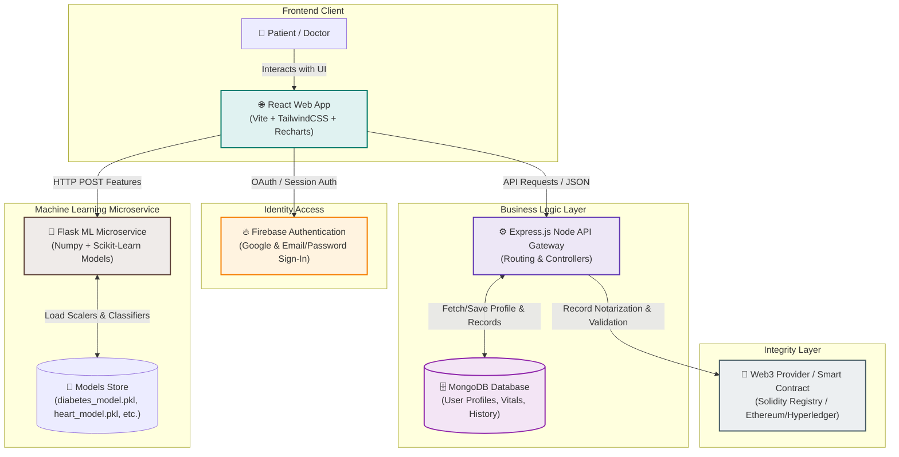
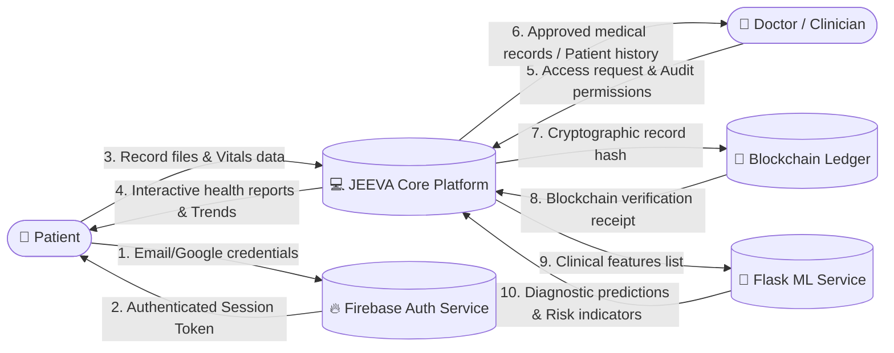
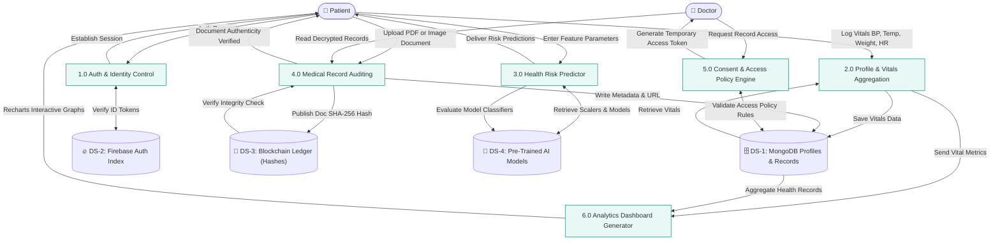
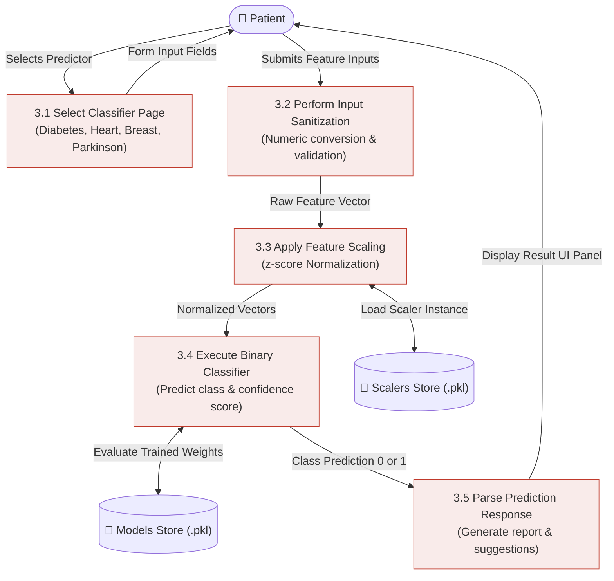
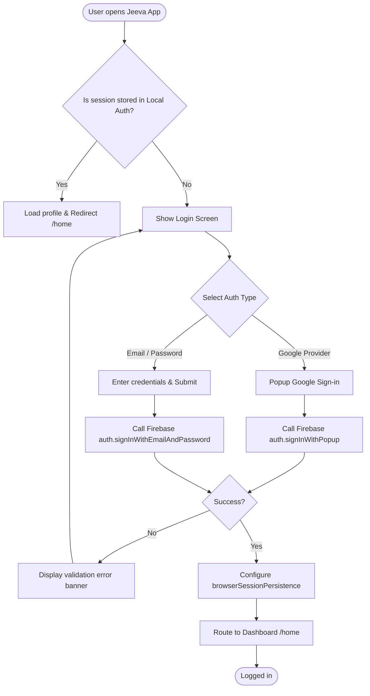
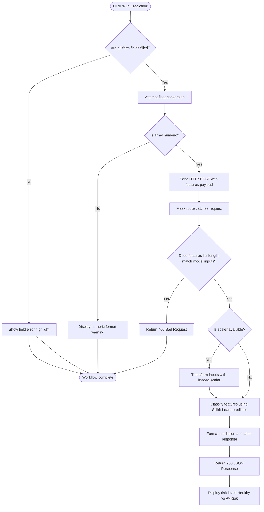
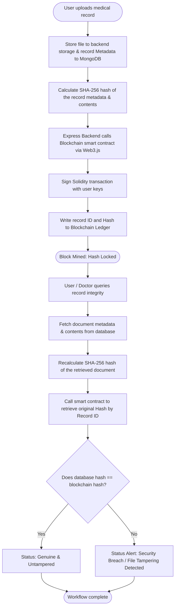

# 🏥 JEEVA – Digital Health Record Management System

<p align="center">
  
  
  
</p>

---

## 🌟 1. Executive Summary & Overview

**JEEVA (Joint Enterprise for Excellence in Vitality Assurance)** is a state-of-the-art Digital Health Record (DHR) management platform. It fuses **Machine Learning (ML)** diagnostic analytics with **Blockchain** data integrity layers to create a secure, private, and intelligent ecosystem for patients, doctors, and healthcare institutions.

At its core, JEEVA resolves critical issues in modern healthcare IT:
*   **Scattered Medical Records:** Unifies fragmented records under a single profile with user-controlled tabs (Overview, History, Medications, Reports, and Bills).
*   **Data Tampering & Integrity:** Employs decentralized ledger technologies to store cryptographic hashes of health records, making malicious edits instantly detectable.
*   **Consent-Driven Access:** Gives patients complete ownership over who accesses their records (doctors, clinics, or research entities).
*   **Pre-emptive AI Diagnostics:** Offers immediate screening tools for high-impact chronic conditions (Diabetes, Heart Disease, Breast Cancer, and Parkinson’s) using machine learning.

---

## 🎨 2. Architectural Design

JEEVA adopts a **Decoupled Microservice Architecture** to maintain clean boundaries between user interfaces, cryptographic validation layers, and heavy ML calculations.

### High-Level Architecture Block Diagram



---

## 📊 3. Data Flow Diagrams (DFD)

### Level 0 DFD: Context Diagram
The Context Diagram represents the system boundaries, showing external entities and their major interactions with the JEEVA Platform.



---

### Level 1 DFD: Core Processes
Level 1 outlines how data flows across the system's subsystems, processes, databases, and key external services.



---

### Level 2 DFD: AI Health Risk Prediction Pipeline
Detailed process decomposition representing feature processing, feature scaling, model scoring, and result packaging.



---

## 🔄 4. System Flowcharts

### 4.1 Authentication & Authorization Flow
Shows the logic for user login, handling Firebase persistence, and routing.



---

### 4.2 AI Health Prediction Flow
Details the operations executed when running a prediction model in real time.



---

### 4.3 Blockchain Record Auditing Flow
Tracks the process of writing records to database, generating and locking record hashes on the Blockchain, and verifying record integrity.



---

## 🧠 5. Machine Learning Predictors

JEEVA offers four pre-trained diagnostic predictors. When users submit inputs, they undergo preprocessing in the Python Flask service.

### 5.1 Models Specification

| Model Name | Target Prediction | Features Count | Core Features List | Backend Endpoint |
| :--- | :--- | :---: | :--- | :--- |
| **Diabetes Classifier** | Diabetic vs Non-Diabetic | `8` | Pregnancies, Glucose, Blood Pressure, Skin Thickness, Insulin, BMI, Diabetes Pedigree Function, Age | `/predict/diabetes` |
| **Heart Disease Classifier** | Heart Disease vs Healthy Heart | `13` | Age, Sex, CP (Chest Pain Type), Resting BP, Serum Cholesterol, Fasting Blood Sugar, Resting ECG, Max Heart Rate, Exercise Angina, Oldpeak, ST Segment Slope, Number of Major Vessels (ca), Thalassemia (thal) | `/predict/heart` |
| **Breast Cancer Classifier** | Benign (Not Cancer) vs Malignant | `30` | Mean radius, mean texture, mean perimeter, mean area, mean smoothness, mean compactness, mean concavity, mean concave points, mean symmetry, mean fractal dimension (along with corresponding "error" and "worst" values for each) | `/predict/breast` |
| **Parkinson’s Classifier** | Parkinson's Disease Detected vs Healthy | `22` | Vocal patterns & voice metrics: Fundamental frequencies (Fo, Fhi, Flo), Jitter (%, Abs, RAP, PPQ, DDP), Shimmer (dB, APQ3, APQ5, APQ, DDA), Noise-to-Harmonic ratio (NHR), HNR, RPDE, DFA, Spread1, Spread2, D2, PPE | `/predict/parkinsons` |

### 5.2 Python Flask Pipeline Implementation

```python
# app.py code snippet showing preprocessing & scaling logic
@app.post("/predict/diabetes")
def predict_diabetes():
    try:
        # 1. Input Validation
        ok, val = validate_features(request.get_json(force=True), expected_len=8)
        if not ok:
            return jsonify({"error": val}), 400

        X = val  # numpy array shape (1,8)
        
        # 2. Scaling transformation
        if "diabetes_scaler" in loaded:
            X = loaded["diabetes_scaler"].transform(X)
            
        if "diabetes_model" not in loaded:
            return jsonify({"error": "Diabetes model not loaded on server."}), 500

        # 3. Model Scoring
        pred = loaded["diabetes_model"].predict(X)[0]
        return jsonify({
             "prediction": int(pred),
             "result": "Diabetic" if int(pred) == 1 else "Non-Diabetic"
        }), 200
    except Exception as e:
        return jsonify({"error": str(e)}), 500
```

---

## 🗄️ 6. Database Schema Design (MongoDB)

Here are the conceptual schemas used in JEEVA's database.

### 6.1 Users Collection
Stores personal information, authentication reference IDs, and role permissions.
```json
{
  "_id": "ObjectId('65f2a1b9e077a94b5c8c221a')",
  "uid": "FIREBASE_UID_102837482",
  "displayName": "Anikesh Sharma",
  "email": "anikesh@jeeva.ai",
  "role": "Patient",
  "createdAt": "2026-04-14T11:40:28.000Z"
}
```

### 6.2 Patient Vitals Collection
Maintains real-time vital readings logged by patients or synchronized devices.
```json
{
  "_id": "ObjectId('65f2a1b9e077a94b5c8c221b')",
  "patientId": "PAT-2024-8592",
  "vitals": {
    "bloodPressure": "120/80",
    "heartRate": 72,
    "spO2": 98,
    "temperature": 98.6,
    "weightKg": 75,
    "heightCm": 178,
    "bmi": 23.7
  },
  "allergies": ["Penicillin", "Peanuts"],
  "updatedAt": "2026-06-01T10:43:00.000Z"
}
```

### 6.3 Medical Records Audit Collection
Stores metadata for uploaded documents along with reference hashes for integrity verification on the blockchain.
```json
{
  "_id": "ObjectId('65f2a1b9e077a94b5c8c221c')",
  "patientId": "PAT-2024-8592",
  "recordName": "Cardiology Report.pdf",
  "fileUrl": "https://storage.jeeva.ai/records/cardio-8592.pdf",
  "documentHash": "3f7c9e0a2d5f8b6e7a4c2d8a0c5f6e8b2a5c4d1e8f9a7b6c5d4e3f2a1b0c9d8e",
  "blockchainTxId": "0x5c8e4a9f2b8c5d6e2a1b0c9d8e7f6a5b4c3d2e1f0a9b8c7d6e5f4a3b2c1d0e",
  "uploadedBy": "Dr. Sharma",
  "timestamp": "2026-05-30T14:15:00.000Z"
}
```

---

## 🛠️ 7. Installation & Setup Guide

### 7.1 ML Microservice Configuration
1. Navigate to the ML folder:
   ```bash
   cd ml-service/jeeva-ml
   ```
2. Create and activate a Python virtual environment:
   ```bash
   python -m venv venv
   # On Windows:
   venv\Scripts\activate
   # On macOS/Linux:
   source venv/bin/activate
   ```
3. Install model execution dependencies:
   ```bash
   pip install -r requirements.txt
   ```
4. Verify pre-trained models are located inside the `models/` directory:
   *   `diabetes_model.pkl` & `diabetes_scaler.pkl`
   *   `heart_model.pkl`
   *   `breast_cancer_model.pkl`
   *   `parkinsons_model.pkl` & `parkinsons_scaler.pkl`
5. Boot up the server:
   ```bash
   python app.py
   ```
   *The ML API runs locally on `http://127.0.0.1:5000`.*

### 7.2 Frontend Web App Setup
1. Navigate to the frontend workspace:
   ```bash
   cd frontend/jeeva-frontend
   ```
2. Populate the `.env` file with your Firebase credentials:
   ```env
   VITE_FIREBASE_API_KEY=your-api-key
   VITE_FIREBASE_AUTH_DOMAIN=your-auth-domain
   VITE_FIREBASE_PROJECT_ID=your-project-id
   VITE_FIREBASE_STORAGE_BUCKET=your-storage-bucket
   VITE_FIREBASE_MESSAGING_SENDER_ID=your-sender-id
   VITE_FIREBASE_APP_ID=your-app-id
   ```
3. Install frontend modules:
   ```bash
   npm install
   ```
4. Start the Vite development server:
   ```bash
   npm run dev
   ```
   *The application will boot up at `http://localhost:5173`.*

---

## 🚀 8. Future Milestones & Features

1.  **Decentralized Access Consents:** Enable patient smart contracts where access rights are granted or revoked directly by signed Web3 transactions.
2.  **Emergency Override Key (Break-the-Glass):** A secure emergency protocol allowing certified hospital entities to retrieve critical vitals without consent delays, logged to the blockchain for audit trails.
3.  **Real-Time Diagnostics Feed:** Connect wearable IoT devices (smartwatches/glucose monitors) directly to MongoDB via WebSockets to feed data to real-time risk trackers.

---
<p align="center">
  ❤️ Engineered for Health Security by <b>Team Arceus 🍀</b>
</p>
